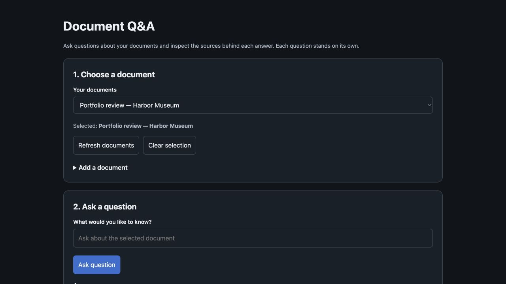
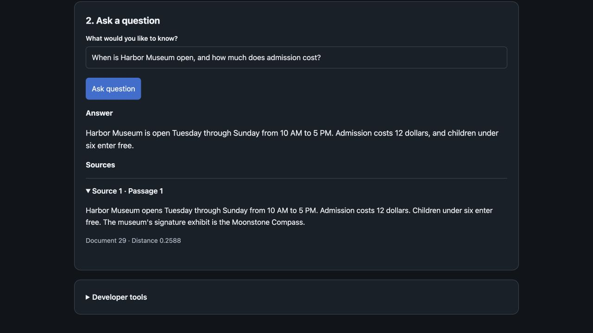

# Document Q&A (Django + pgvector)

A local document Q&A portfolio application built with Django and Postgres (pgvector). It lets you ingest text, text-based PDFs, and `.txt`/`.md` files, store their embeddings, retrieve relevant chunks, and ask an AI model to answer using those sources.
For local development, the database runs via **Docker Compose** (Postgres + pgvector), with a non-Docker option included.

This project is meant as a portfolio-ready demonstration of a real RAG pipeline:
- ingestion (text / text-based PDF / `.txt` / `.md`)
- chunking
- embeddings storage (Postgres + pgvector)
- similarity search (cosine distance)
- source-guided answering with retrieved source chunks
- a document-first web UI with source passages and collapsible developer tools

---

## Features

- **Ingest text** (title + body)
- **Ingest text-based PDFs** (multipart upload; extract text then chunk; no OCR)
- **Ingest `.txt` and `.md` files** (multipart upload; decode as text then chunk)
- **Vector search with pgvector** (Cosine distance in Postgres)
- **RAG answering** (LLM is instructed to use only retrieved chunks; responses include sources)
- **“I don’t know” guardrail** when similarity is too low
- **Document selection** stored in session (`current_document_id`)
- **Query logging** for debugging (latency, best distance, sources, errors)
- Separate ingestion and question-answering endpoints

---

## Screenshots

### Document selection and Q&A

Choose a document by name, add files or pasted text, and ask a question. Diagnostics are available under **Developer tools**.



### Answer with supporting sources

A live answer from the synthetic Harbor Museum demo, with its supporting passage expanded.



---

## Architecture (high-level)

1. **Ingestion**
   - `Text/PDF/.txt/.md` → extract text → chunk → embed chunks → store chunks + vectors in Postgres
2. **Retrieval**
   - Question → embed → cosine distance search within the selected document → top-k chunks
3. **Generation**
   - Send retrieved chunks as “Sources” → instruct the model to answer using only those sources
4. **Response**
   - Return `answer` + `sources` (doc id, chunk index, distance, chunk text)

---

## Tech stack

- Python 3.12+ + Django 6.0 (tested locally with Python 3.13)
- Postgres + **pgvector**
- **Docker + Docker Compose** (local Postgres + pgvector dev environment)
- OpenAI `text-embedding-3-small` embeddings + `gpt-4.1-mini` answering model
- Minimal HTML/JS UI (fetch-based)

---

## Setup

Prerequisites: Python 3.12 or newer, Git, Docker Desktop (or Docker Engine with Compose), and an OpenAI API key with access to the configured models. Ingestion and answering make billable API calls. The commands below use a macOS/Linux shell and Python 3.13.

### 1) Clone repo & create venv

```bash
git clone https://github.com/LuSilverX/Rag-Chatbot.git rag-chatbot
cd rag-chatbot

python3.13 -m venv .venv
source .venv/bin/activate
```

### 2) Install dependencies

```bash
python -m pip install -r requirements.txt
```
### 3) Configure environment variables
Create a `.env` file in the project root:

```dotenv
OPENAI_API_KEY="your_key_here"
```
`manage.py` already loads `.env` with python-dotenv. Alternatively, export `OPENAI_API_KEY` in your shell. The `.env` file is excluded from Git. Other entry points, such as a production WSGI/ASGI server, need environment variables supplied separately.

### 4) Start Postgres + pgvector (Docker)
Open Docker Desktop and wait until its engine is running (or start your Docker Engine service). Then run this from the project folder to start PostgreSQL 16 with pgvector:

```bash
docker compose up -d
```

The container is named `rag_pg`. Django connects to `ragdb` at `127.0.0.1:5432` using the local development credentials in `docker-compose.yml` and `config/settings.py`. Database contents persist in the Compose-managed `pgdata` volume when the container stops.

**Option B: Local Postgres (no Docker)**

Install and start PostgreSQL, and install the pgvector extension files for that PostgreSQL version. Using a PostgreSQL administrator account, create the application role first, then a database owned by that role:

```bash
createuser raguser --pwprompt
createdb --owner=raguser ragdb
psql -d ragdb -c "CREATE EXTENSION IF NOT EXISTS vector;"
```
Update your Django DATABASES config (example):

```python
DATABASES = {
  "default": {
    "ENGINE": "django.db.backends.postgresql",
    "NAME": "ragdb",
    "USER": "raguser",
    "PASSWORD": "your_password",
    "HOST": "127.0.0.1",
    "PORT": "5432",
  }
}
```

### 5) Run migrations

```bash
python manage.py migrate
```

Migrations are already included in the repository. Use `makemigrations` only when developing model changes.

### 6) Run the server

```bash
python manage.py runserver
```

Open:
http://127.0.0.1:8000/ (UI)

Keep the terminal open; press **Control+C** to stop Django. If port 8000 is occupied, use `python manage.py runserver 8001` and open http://127.0.0.1:8001/ instead. Update the port in API examples accordingly.

For later sessions, start Docker, run `docker compose up -d`, activate `.venv`, and start Django. If you move the project folder, recreate `.venv` and reinstall dependencies because virtual environments contain absolute paths.

---

## Quick demo (sample docs + test questions)

This repo includes `sample_docs/` so you can try the app immediately after setup.

### 1) Ingest a sample document
In the UI, expand **Add a document** and use **Upload document**:
- Upload a text file:
  - `sample_docs/demo.txt`
  - `sample_docs/infra_notes.txt`
  - `sample_docs/policies.txt`
- Or upload the PDF:
  - `sample_docs/RAG_MVP_Demo_PDF.pdf`

### 2) Ask sample questions

**After ingesting `demo.txt`:**
- What is RAG?
- List the steps of the RAG pipeline.
- What database + extension are used for vector search?
- What does cosine distance mean here?
- What should the system do if sources don’t contain the answer?
- **Guardrail test:** What year was this project founded?

**After ingesting `infra_notes.txt`:**
- Why does this project use Docker Compose?
- What is pgvector used for?
- What does “smaller distance” mean?
- **Guardrail test:** What is the CEO’s name?

**After ingesting `policies.txt`:**
- How long should passwords be?
- Is MFA required? For who?
- Who can access production databases?
- How far in advance should PTO be requested?
- **Guardrail test:** What is the company’s stock ticker?

**After ingesting `RAG_MVP_Demo_PDF.pdf`:**
- Summarize this PDF briefly.
- What are the three stages of the RAG pipeline described here?
- What does cosine distance mean, and what does a lower distance indicate?
- Why does chunking improve retrieval quality?
- When should the system respond “I don’t know”?
- **Guardrail test:** What is the author’s phone number?

---

### Optional: API demo (ingest, then ask)

Ingestion and answering are separate requests. These examples save the session cookie so `/api/ask/` uses the document selected by ingestion. Alternatively, pass the returned `document_id` explicitly in the question JSON.

**Ingest text**
```bash
curl -sS -c /tmp/rag-demo-cookies.txt -X POST http://127.0.0.1:8000/api/ingest_text/ \
  -H "Content-Type: application/json" \
  -d '{"title":"Mini","text":"Cars use engines. Tires touch the road."}' | python -m json.tool
```

**Ask about the ingested document**
```bash
curl -sS -b /tmp/rag-demo-cookies.txt -X POST http://127.0.0.1:8000/api/ask/ \
  -H "Content-Type: application/json" \
  -d '{"question":"What does it say about cars?","k":5}' | python -m json.tool
```

**Ingest a PDF, then ask about it**
```bash
curl -sS -c /tmp/rag-demo-cookies.txt -X POST http://127.0.0.1:8000/api/ingest_pdf/ \
  -F "file=@sample_docs/RAG_MVP_Demo_PDF.pdf" | python -m json.tool

curl -sS -b /tmp/rag-demo-cookies.txt -X POST http://127.0.0.1:8000/api/ask/ \
  -H "Content-Type: application/json" \
  -d '{"question":"Summarize this PDF briefly.","k":8}' | python -m json.tool
```

## Verification and evaluation

Run the regression tests (Postgres must be running):

```bash
python manage.py test --noinput
```

Tests use mocked AI calls and an isolated test database. They cover atomic updates, embedding/write failures, bounded chunking, invalid inputs, upload validation, document scoping, abstention and history status.

Run the live 20-question evaluation:

```bash
python manage.py evaluate_rag
```

This sends only the synthetic museum fixture in `evaluations/cases.json` to OpenAI and makes billable API calls. It creates temporary evaluation records inside a transaction and rolls them back, preserving existing documents and logs. It writes answers, source passages, distances, latency and scoring results to `evaluations/latest.json`. A failed answer or evidence check makes the command exit unsuccessfully.

The recorded run passed **20/20 answer checks**, including **12/12 supported answers**, **8/8 unsupported-question abstentions**, and **12/12 expected-evidence retrieval checks**. Median latency was **1,219 ms**. See [evaluation details](evaluations/README.md) for the rubric and limits. Results are a small synthetic demonstration, not a general accuracy guarantee.

## Interface and input behavior

- Select a document by name, then ask a question. Each question is independent; this application does not maintain conversational memory.
- Expand **Add a document** to paste text or upload a PDF, TXT or Markdown file. Text files use the dedicated file-upload endpoint.
- **Developer tools** contains retrieval settings, raw ingestion responses, vector search, history and the existing reset control.
- Uploads and pasted text are limited to 2 MB. Chunks contain at most 900 characters, with up to 200 characters of overlap and sentence/word boundaries preferred.
- Invalid JSON, unsupported files, corrupt PDFs and invalid numeric parameters return readable validation errors. AI failures return a retryable service error; network failures restore the interface controls.
- History distinguishes **Answered**, **Unanswered** and **Error** and preserves zero-valued distance/latency readings.

## Current limitations

- PDF ingestion requires extractable text; scanned/image-only PDFs need OCR elsewhere first.
- The model is instructed to stay within the sources, but this does not guarantee factual answers or inline citations. Check the returned source chunks.
- `/api/ask/` searches one document at a time. It uses an explicit `document_id`, then the session selection, or the latest document for certain document-summary questions. The separate `/api/retrieve/` endpoint searches across documents.
- The distance guardrail returns “I don't know” when no chunks are found or the best cosine distance exceeds `max_distance` (default `0.95`). This threshold does not guarantee that every unsupported question will be rejected.
- Re-ingesting the same title and source type replaces that document's chunks. Replacement embeddings are generated first; database replacement is atomic, so embedding or database-write failures preserve the previous chunks. Concurrent first-time uploads with identical titles are not deduplicated by a database constraint.
- This is a local development demo: debug mode, development credentials, and unauthenticated API endpoints require changes before public deployment.
