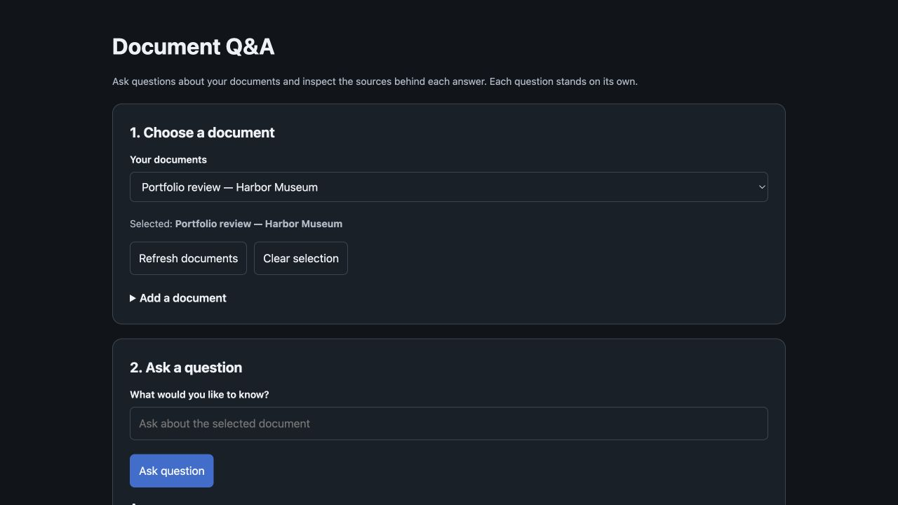
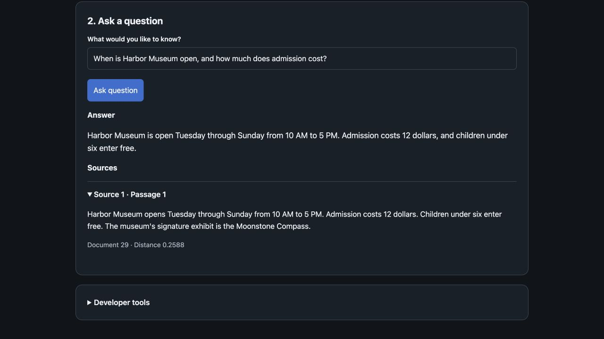

# Document Q&A (Django + pgvector)

A local document Q&A portfolio application built with Django and Postgres (pgvector). It lets you ingest text, text-based PDFs, and `.txt`/`.md` files, store their embeddings, retrieve relevant chunks, and ask an AI model to answer using those sources.
For local development, the database runs via **Docker Compose** (Postgres + pgvector), with a non-Docker option included.

This project is meant as a portfolio-ready demonstration of a real RAG pipeline:
- ingestion (text / text-based PDF / `.txt` / `.md`)
- chunking
- embeddings storage (Postgres + pgvector)
- similarity search (cosine distance)
- source-guided answering with retrieved source chunks
- a document-first web UI with source passages and collapsible developer tools

---

## Features

- **Ingest text** (title + body)
- **Ingest text-based PDFs** (multipart upload; extract text then chunk; no OCR)
- **Ingest `.txt` and `.md` files** (multipart upload; decode as text then chunk)
- **Vector search with pgvector** (Cosine distance in Postgres)
- **RAG answering** (LLM is instructed to use only retrieved chunks; responses include sources)
- **“I don’t know” guardrail** when similarity is too low
- **Document selection** stored in session (`current_document_id`)
- **Query logging** for debugging (latency, best distance, sources, errors)
- Separate ingestion and question-answering endpoints

---

## Screenshots

### Document selection and Q&A

Choose a document by name, add files or pasted text, and ask a question. Diagnostics are available under **Developer tools**.



### Answer with supporting sources

A live answer from the synthetic Harbor Museum demo, with its supporting passage expanded.



---

## Architecture (high-level)

1. **Ingestion**
   - `Text/PDF/.txt/.md` → extract text → chunk → embed chunks → store chunks + vectors in Postgres
2. **Retrieval**
   - Question → embed → cosine distance search within the selected document → top-k chunks
3. **Generation**
   - Send retrieved chunks as “Sources” → instruct the model to answer using only those sources
4. **Response**
   - Return `answer` + `sources` (doc id, chunk index, distance, chunk text)

---

## Tech stack

- Python 3.12+ + Django 6.0 (tested locally with Python 3.13)
- Postgres + **pgvector**
- **Docker + Docker Compose** (local Postgres + pgvector dev environment)
- OpenAI `text-embedding-3-small` embeddings + `gpt-4.1-mini` answering model
- Minimal HTML/JS UI (fetch-based)

---

## Setup

Prerequisites: Python 3.12 or newer, Git, Docker Desktop (or Docker Engine with Compose), and an OpenAI API key with access to the configured models. Ingestion and answering make billable API calls. The commands below use a macOS/Linux shell and Python 3.13.

### 1) Clone repo & create venv

```bash
git clone https://github.com/LuSilverX/Rag-Chatbot.git rag-chatbot
cd rag-chatbot

python3.13 -m venv .venv
source .venv/bin/activate
```

### 2) Install dependencies

```bash
python -m pip install -r requirements.txt
```
### 3) Configure environment variables
Copy `.env.example` to `.env`, set your OpenAI API key, and generate a unique Django secret:

```bash
cp .env.example .env
python -c "import secrets; print(secrets.token_urlsafe(64))"
```
Paste the generated value into `DJANGO_SECRET_KEY` in `.env`. Keep `DJANGO_DEBUG=true` for local HTTP development. Never commit real secrets. Settings load `.env` for management commands, WSGI and ASGI; exported environment variables take precedence.

### 4) Start Postgres + pgvector (Docker)
Open Docker Desktop and wait until its engine is running (or start your Docker Engine service). Then run this from the project folder to start PostgreSQL 16 with pgvector:

```bash
docker compose up -d
```

The container is named `rag_pg`. Django connects to `ragdb` at `127.0.0.1:5432` using the local development credentials in `docker-compose.yml` and `config/settings.py`. Database contents persist in the Compose-managed `pgdata` volume when the container stops.

**Option B: Local Postgres (no Docker)**

Install and start PostgreSQL, and install the pgvector extension files for that PostgreSQL version. Using a PostgreSQL administrator account, create the application role first, then a database owned by that role:

```bash
createuser raguser --pwprompt
createdb --owner=raguser ragdb
psql -d ragdb -c "CREATE EXTENSION IF NOT EXISTS vector;"
```
Update your Django DATABASES config (example):

```python
DATABASES = {
  "default": {
    "ENGINE": "django.db.backends.postgresql",
    "NAME": "ragdb",
    "USER": "raguser",
    "PASSWORD": "your_password",
    "HOST": "127.0.0.1",
    "PORT": "5432",
  }
}
```

### 5) Run migrations

```bash
python manage.py migrate
```

Migrations are already included in the repository. Use `makemigrations` only when developing model changes.

### 6) Run the server

```bash
python manage.py runserver
```

Open:
http://127.0.0.1:8000/ (UI)

Keep the terminal open; press **Control+C** to stop Django. If port 8000 is occupied, use `python manage.py runserver 8001` and open http://127.0.0.1:8001/ instead. Update the port in API examples accordingly.

For later sessions, start Docker, run `docker compose up -d`, activate `.venv`, and start Django. If you move the project folder, recreate `.venv` and reinstall dependencies because virtual environments contain absolute paths.

---

## Quick demo (sample docs + test questions)

This repo includes `sample_docs/` so you can try the app immediately after setup.

### 1) Ingest a sample document
In the UI, expand **Add a document** and use **Upload document**:
- Upload a text file:
  - `sample_docs/demo.txt`
  - `sample_docs/infra_notes.txt`
  - `sample_docs/policies.txt`
- Or upload the PDF:
  - `sample_docs/RAG_MVP_Demo_PDF.pdf`

### 2) Ask sample questions

**After ingesting `demo.txt`:**
- What is RAG?
- List the steps of the RAG pipeline.
- What database + extension are used for vector search?
- What does cosine distance mean here?
- What should the system do if sources don’t contain the answer?
- **Guardrail test:** What year was this project founded?

**After ingesting `infra_notes.txt`:**
- Why does this project use Docker Compose?
- What is pgvector used for?
- What does “smaller distance” mean?
- **Guardrail test:** What is the CEO’s name?

**After ingesting `policies.txt`:**
- How long should passwords be?
- Is MFA required? For who?
- Who can access production databases?
- How far in advance should PTO be requested?
- **Guardrail test:** What is the company’s stock ticker?

**After ingesting `RAG_MVP_Demo_PDF.pdf`:**
- Summarize this PDF briefly.
- What are the three stages of the RAG pipeline described here?
- What does cosine distance mean, and what does a lower distance indicate?
- Why does chunking improve retrieval quality?
- When should the system respond “I don’t know”?
- **Guardrail test:** What is the author’s phone number?

---

### Optional: API demo (ingest, then ask)

Ingestion and answering are separate requests. These examples save the session cookie so `/api/ask/` uses the document selected by ingestion. Alternatively, pass the returned `document_id` explicitly in the question JSON.

**Ingest text**
```bash
curl -sS -c /tmp/rag-demo-cookies.txt -X POST http://127.0.0.1:8000/api/ingest_text/ \
  -H "Content-Type: application/json" \
  -d '{"title":"Mini","text":"Cars use engines. Tires touch the road."}' | python -m json.tool
```

**Ask about the ingested document**
```bash
curl -sS -b /tmp/rag-demo-cookies.txt -X POST http://127.0.0.1:8000/api/ask/ \
  -H "Content-Type: application/json" \
  -d '{"question":"What does it say about cars?","k":5}' | python -m json.tool
```

**Ingest a PDF, then ask about it**
```bash
curl -sS -c /tmp/rag-demo-cookies.txt -X POST http://127.0.0.1:8000/api/ingest_pdf/ \
  -F "file=@sample_docs/RAG_MVP_Demo_PDF.pdf" | python -m json.tool

curl -sS -b /tmp/rag-demo-cookies.txt -X POST http://127.0.0.1:8000/api/ask/ \
  -H "Content-Type: application/json" \
  -d '{"question":"Summarize this PDF briefly.","k":8}' | python -m json.tool
```

## Verification and evaluation

Run the regression tests (Postgres must be running):

```bash
python manage.py test --noinput
```

Tests use mocked AI calls and an isolated test database. They cover atomic updates, embedding/write failures, bounded chunking, invalid inputs, upload validation, document scoping, abstention and history status.

Run the live 20-question evaluation:

```bash
python manage.py evaluate_rag
```

This sends only the synthetic museum fixture in `evaluations/cases.json` to OpenAI and makes billable API calls. It creates temporary evaluation records inside a transaction and rolls them back, preserving existing documents and logs. It writes answers, source passages, distances, latency and scoring results to `evaluations/latest.json`. A failed answer or evidence check makes the command exit unsuccessfully.

The recorded run passed **20/20 answer checks**, including **12/12 supported answers**, **8/8 unsupported-question abstentions**, and **12/12 expected-evidence retrieval checks**. Median latency was **1,219 ms**. See [evaluation details](evaluations/README.md) for the rubric and limits. Results are a small synthetic demonstration, not a general accuracy guarantee.

## Interface and input behavior

- Select a document by name, then ask a question. Each question is independent; this application does not maintain conversational memory.
- Expand **Add a document** to paste text or upload a PDF, TXT or Markdown file. Text files use the dedicated file-upload endpoint.
- **Developer tools** contains retrieval settings, raw ingestion responses, vector search, history and the existing reset control.
- Uploads and pasted text are limited to 2 MB. Chunks contain at most 900 characters, with up to 200 characters of overlap and sentence/word boundaries preferred.
- Invalid JSON, unsupported files, corrupt PDFs and invalid numeric parameters return readable validation errors. AI failures return a retryable service error; network failures restore the interface controls.
- History distinguishes **Answered**, **Unanswered** and **Error** and preserves zero-valued distance/latency readings.

## Current limitations

- PDF ingestion requires extractable text; scanned/image-only PDFs need OCR elsewhere first.
- The model is instructed to stay within the sources, but this does not guarantee factual answers or inline citations. Check the returned source chunks.
- `/api/ask/` searches one document at a time. It uses an explicit `document_id`, then the session selection, or the latest document for certain document-summary questions. The separate `/api/retrieve/` endpoint searches across documents.
- The distance guardrail returns “I don't know” when no chunks are found or the best cosine distance exceeds `max_distance` (default `0.95`). This threshold does not guarantee that every unsupported question will be rejected.
- Re-ingesting the same title and source type replaces that document's chunks. Replacement embeddings are generated first; database replacement is atomic, so embedding or database-write failures preserve the previous chunks. Concurrent first-time uploads with identical titles are not deduplicated by a database constraint.
- Production deployment, general account/login throttling and CI/CD are not yet implemented. Portfolio demo entry and questions have database-backed limits. Authentication and environment-based production settings are in place; a Linux/HTTPS deployment still needs to be configured and verified.


## Authentication and production settings (step 1)

The UI and all document/query APIs require a Django user account. Portfolio visitors can enter through the temporary workspace flow described below. For invited accounts this is a shared knowledge base: users can view, ingest, and replace shared documents and see query history. Visitor access is scoped to its browser workspace rather than this permanent shared area. There is no public registration. Visitors receive isolated, temporary workspaces; owner accounts retain the original shared permanent area.

After applying migrations, create an administrator locally:

```bash
python manage.py createsuperuser
python manage.py runserver
```

Open `/accounts/login/` and sign in. The administrator can create regular users through `/admin/`. Sign out using the button in the app. Login and all modifying browser requests require CSRF protection; the interface supplies the token automatically. Existing curl examples now require a logged-in session cookie and a matching CSRF token (`X-CSRFToken`); anonymous API access is rejected. The reset endpoint additionally requires a staff account and development mode, and its button is hidden otherwise.

Production uses `DJANGO_DEBUG=false` (the default if unset), a separate random `DJANGO_SECRET_KEY` of at least 50 characters, explicit `DJANGO_ALLOWED_HOSTS`, and explicit `POSTGRES_DB`, `POSTGRES_USER`, `POSTGRES_PASSWORD`, and `POSTGRES_HOST`. `POSTGRES_PORT` defaults to 5432. Missing required production configuration prevents startup. Set `DJANGO_CSRF_TRUSTED_ORIGINS` to any required trusted HTTPS origins, separated by commas.

Production settings enforce HTTPS redirects, secure session/CSRF cookies, and one-hour HSTS. HSTS subdomain coverage and browser preloading remain off until the eventual domain configuration is known; deployment checks therefore report W005 and W021 for those optional policies. `DJANGO_TRUST_PROXY=true` is only appropriate behind a trusted proxy that overwrites `X-Forwarded-Proto` and prevents clients from reaching Gunicorn directly. It is disabled by default. Static assets can be collected into `staticfiles/`; serving them is part of the later deployment step. These settings do not themselves provision HTTPS or deploy the application.

The synthetic evaluation command creates a temporary authenticated user and rolls it back with the evaluation documents/logs. It still makes billable live AI calls and evaluates application behavior rather than the browser login or deployed HTTPS stack.


## Temporary visitor workspaces

**Try the demo** is a CSRF-protected POST that creates a private workspace without signup. Each browser session receives an unguessable workspace ID bound to that session, using the existing non-staff identity with no usable password. All document and history queries are scoped to the workspace. Supplying another document/workspace ID does not grant access. Owner sign-in uses the separate permanent area and does not list visitors' temporary content.

Visitors can upload PDF/TXT/Markdown files or paste text, ask questions, inspect retrieved passages, search their documents, read their own answers/history/distances/latency, replace documents, and delete documents plus associated history. They can edit or delete their own copies of the two samples without changing the templates or other visitors' data. JSON/CSV support is a separate upcoming step.

### Setup and cleanup

```bash
python manage.py migrate
python manage.py prepare_demo
python manage.py runserver
```

Preparation embeds only the bundled museum fixture and `sample_docs/demo.txt` and skips ready samples on repeat runs. Each new visitor gets copies of these documents and their vectors, with no additional embedding calls. Templates have `is_demo=True` and no workspace; visitor copies are ordinary editable documents owned by their workspace. Existing private documents are never copied.

Run the cleanup worker alongside the web server in another terminal:

```bash
python manage.py cleanup_workspaces --watch
```

A workspace expires **24 hours after creation**, independent of activity. Expiration immediately denies reads and writes; the cleanup worker checks every 60 seconds and cascades deletion to the expired workspace's documents, vectors, and query logs. The worker retries database failures. It must remain running; a sleeping/stopped computer cannot run cleanup. New demo entry also attempts cleanup. Production process supervision/scheduling will be wired during the deployment step. For a scheduler or manual cleanup, run `python manage.py cleanup_workspaces` without `--watch`.

Signing out or clearing cookies loses access to the workspace; it still expires on its original schedule. Existing non-expired sessions are reused when clicking Try the demo again. Visitor uploads are extracted in memory; the app does not save original uploaded files. Deletion refers to this application's stored data, not third-party API retention. The entry page discloses that uploads/questions go to OpenAI and asks visitors to use non-sensitive content.

### Bounds and concurrency

- Five documents per workspace, including the two sample copies. Delete or replace a document to make room.
- 2 MB uploaded file/text request limit, 20 PDF pages, and 20,000 extracted characters per visitor document.
- Up to 1,000 characters per question/search, three retrieved passages, and 300 answer output tokens.
- Questions and vector searches share budgets: 10 per session/hour, 30 per network address/hour, 100 globally/day.
- Upload/replacement attempts have separate budgets: 5 per session/hour, 10 per network address/hour, 30 globally/day.
- Entry is limited to 20 new workspaces per network address/hour and 500 globally/day.

Quotas use fixed UTC windows and atomic PostgreSQL counters across workers. Billable attempts reserve capacity before calling OpenAI, even if the provider later fails. Replacing a document generates embeddings before atomically changing the stored content; workspace row locks and a uniqueness constraint prevent cross-visitor collisions and enforce document caps under concurrent writes. Expiration is rechecked before committing uploads. These are bounded request budgets, not exact dollar limits.

Only `REMOTE_ADDR` is trusted for network limits. Configure real-client-address handling with the trusted reverse proxy during deployment; do not accept arbitrary forwarded headers from visitors. Login brute-force protection for ordinary accounts remains separate deployment work. Periodically run `cleanup_demo_limits` and Django's `clearsessions` to remove expired counter/session records; these do not contain document text.
